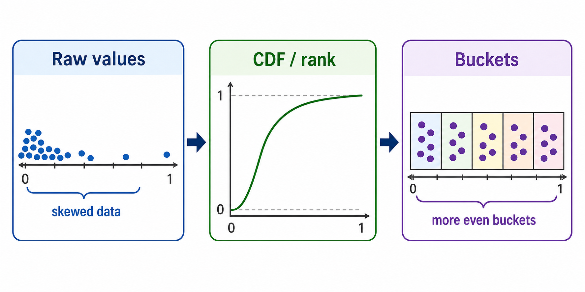
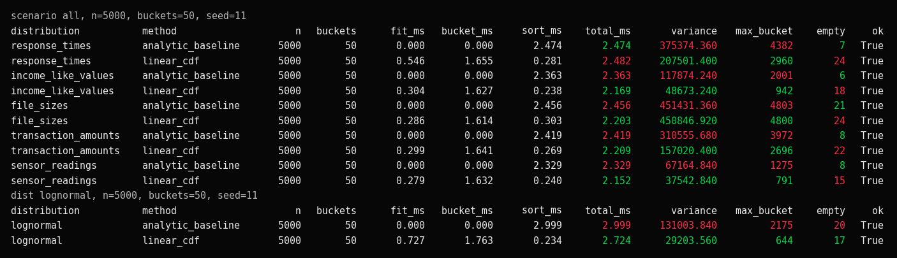
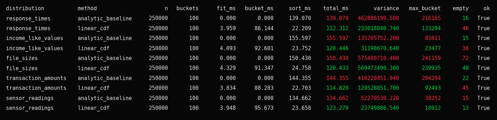
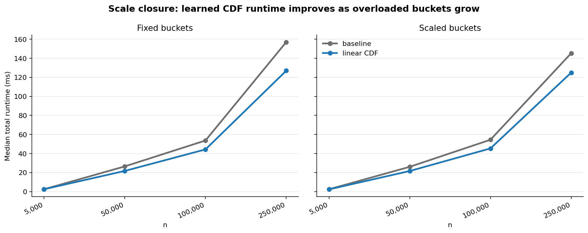
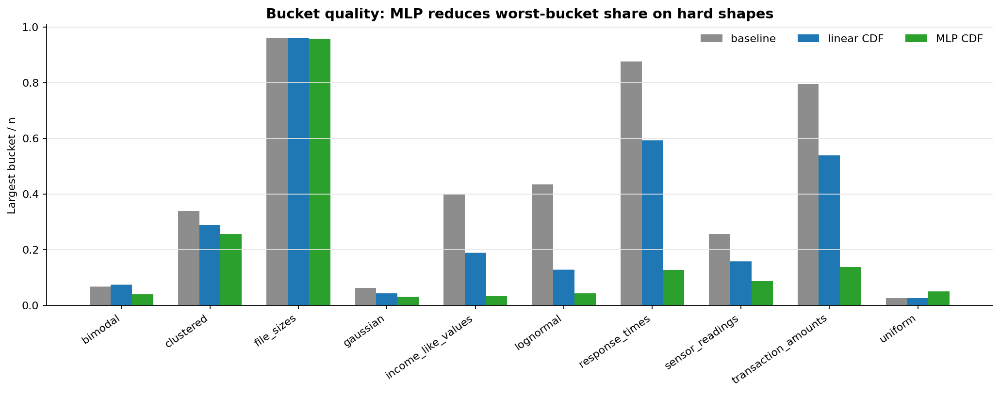
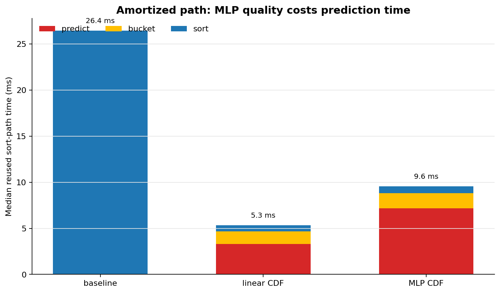

# Learned Bucket Sort Predictor: Walkthrough

This walkthrough explains the project from the point of view of a first-time
reader: what problem it studies, how the learned CDF index works, what the
benchmarks measure, and what the current evidence supports.

## 1. The Sorting Problem

Bucket sort is fast when each bucket receives about the same number of values.
The final output is still correct because every bucket is sorted before the
buckets are concatenated. The question is whether the bucket assignment step
creates cheap work or expensive work.

If one bucket receives many more values than the others, the whole sort slows
down around that overloaded bucket.

## 2. The Classic Baseline

The baseline uses min-max scaling:

```text
bucket(x) = floor(bucket_count * (x - min_value) / (max_value - min_value))
```

That is a good index when values are close to uniform across the value range.
It can break down on skewed, clustered, or long-tailed data because equal-width
value ranges do not imply equal bucket counts.

## 3. Why Skewed Data Breaks Buckets

The project uses controlled distributions and realistic synthetic scenarios to
stress the bucket index.

Controlled distributions:

- `uniform`
- `gaussian`
- `lognormal`
- `bimodal`
- `clustered`

Realistic scenarios:

- `response_times`
- `income_like_values`
- `file_sizes`
- `transaction_amounts`
- `sensor_readings`

One dataset tells us what happened once. A suite of shapes shows why it
happened.

## 4. The Learned CDF Idea

A CDF maps a value to its approximate rank:

```text
cdf(x) ~= fraction of values <= x
```

Ranks are naturally spread across `[0, 1]`. If a model can predict rank-like
values, then bucket assignment can happen in rank space instead of raw value
space:

```text
classic bucket = floor(bucket_count * minmax_normalize(x))
learned bucket = floor(bucket_count * learned_cdf(x))
```



The sorting algorithm downstream does not change. Only the bucket index changes.

## 5. What The Project Implements

Current benchmark methods:

- `analytic_baseline`: fixed min-max bucket assignment.
- `linear_cdf`: CPU linear CDF estimator.
- `mlp_cdf`: optional Torch MLP CDF estimator on CPU or CUDA.

The pipeline is:

```text
values
-> empirical CDF training pairs
-> CDF model(value -> rank)
-> predicted rank per value
-> learned bucket index
-> sort inside buckets
-> compare against reference sort
```

The MLP path uses Torch only when selected. The non-MLP paths run without Torch.
Benchmark rows report `device` so CPU and CUDA results are not mixed together.

## 6. What The Metrics Mean

Important metrics:

- `variance`: lower means bucket sizes are more balanced.
- `max_bucket`: lower means the worst bucket is smaller.
- `empty`: lower means fewer buckets were wasted.
- `sort_ms`: time spent sorting inside buckets.
- `total_ms`: fit time plus bucket assignment plus sorting.
- `sort_path_total_ms`: reused-model prediction, bucketing, and sorting.
- `end_to_end_total_ms`: training plus reused-model sort path.
- `ok`: final output matched the reference sort.

The ML path should be judged by both bucket quality and runtime. A better model
is not automatically faster if prediction or training costs too much.

## 7. First Benchmark Readout



Readout:

- `linear_cdf` usually cuts `sort_ms` because the largest buckets get smaller.
- `linear_cdf` improves variance and max bucket on many skewed shapes.
- `empty` can get worse when predictions compress into a narrower rank range.
- `file_sizes` remains hard because its shape is extreme.
- At small `n`, model overhead can hide the saved sort work.

## 8. Scaling Evidence

Scaling matters because overloaded buckets become more expensive as `n` grows.
At `n=250000`, the learned linear path wins total runtime on all five realistic
scenarios in the promoted run.



The broader scale plot uses fresh numeric artifacts across controlled
distributions and realistic scenarios. Median `total_ms` favors `linear_cdf`
more clearly as `n` grows.



The honest claim:

> Learned CDF bucketing reduces overloaded buckets. That makes the expensive
> intra-bucket sorting step cheaper. Total runtime improves when saved sort work
> is larger than model fit and bucket assignment overhead.

## 9. Bucket Quality vs Runtime

The MLP learns a better CDF shape on many hard datasets, but this does not make
it the fastest method in the current implementation.

| Bucket quality | Reused runtime |
| --- | --- |
|  |  |

Readout:

- `mlp_cdf` usually creates the smallest worst bucket on hard shapes.
- `linear_cdf` has the fastest reused sort path in the current implementation.
- `mlp_cdf` prediction time is still too high to beat `linear_cdf` on reused
  speed here.
- `file_sizes` remains difficult for every current method.

This is normal for this version of the project. The 1D CDF task is simple
enough that a cheap linear model can win on runtime even when the MLP produces
better bucket balance.

## 10. Training Cost vs Reused Model Cost

The regular benchmark answers:

```text
How expensive is this method if it trains during the sort call?
```

The amortized benchmark answers:

```text
If the model is already trained, how expensive is the reused sort path?
```

Those are different claims.

Fresh MLP training includes optimizer work, CUDA setup/synchronization, and data
movement. A trained model removes most of that from the per-sort path, but
prediction still has to be cheap enough to matter.

The current result is:

> `linear_cdf` is the practical runtime win. `mlp_cdf` is the strongest
> bucket-quality result. Those are different claims.

## 11. Correctness Boundary

Every method must match the reference sort. The model is allowed to choose
different buckets, but it is not allowed to change final sorted order.

The MLP path also projects predictions into monotonic order before bucket
assignment. That keeps lower values from receiving higher bucket ranks than
larger values.

Tests protect:

- sorting correctness
- deterministic seeded data generation
- JSON artifact schemas
- generated artifact boundaries
- optional Torch behavior
- CPU/CUDA device reporting
- browser demo claims

Runtime tests do not assert exact milliseconds because wall-clock timing depends
on machine load, Python version, and device state. Performance claims come from
numeric artifacts and promoted plots.

## 12. Browser Demo Boundary

The static browser demo in `mockup/index.html` is educational. It shows the
bucket assignment idea visually, but it does not run the Python models, train
Torch, or load benchmark JSON.

Its public claim matches the benchmarks:

- `linear_cdf` is the current practical runtime win.
- `mlp_cdf` is the strongest bucket-quality result.
- `mlp_cdf` is not a proven speed win yet.

## 13. Reproduce The Evidence

Run tests:

```powershell
.\.venv\Scripts\python.exe -m pytest tests/ -q
```

Run a controlled distribution:

```powershell
.\.venv\Scripts\python.exe -m learned_bucket_sort.benchmark --dist lognormal --n 5000 --buckets 50 --seed 11 --method all
```

Run all scenarios:

```powershell
.\.venv\Scripts\python.exe scripts\generate_scenario_datasets.py --scenario all --n 5000 --seed 11
$manifest = Get-ChildItem datasets\generated\manifest_scenarios_n5000_seed11_*.json | Sort-Object Name | Select-Object -Last 1
.\.venv\Scripts\python.exe -m learned_bucket_sort.benchmark --scenario all --n 5000 --buckets 50 --seed 11 --manifest $manifest.FullName --method all
```

Run reused-model timing:

```powershell
.\.venv\Scripts\python.exe -m learned_bucket_sort.amortized_benchmark --dist lognormal --n 50000 --buckets 100 --train-seed 11 --eval-seed 12 --method all
```

Regenerate the evidence plots:

```powershell
.\.venv\Scripts\python.exe scripts\run_part5_evidence.py
```

Use `--no-color` for copyable plain-text console output.
